# Tooth-Analysis-App
Tooth Analysis App
 - Copyright
   - Deep Learning Model(Teeth) : ⓒ2018-2019 [Info Lab](http://infolab.kunsan.ac.kr) ([Ryu dong jun](https://github.com/rdj94))
   - App & Server : ⓒ2019 [Info Lab](http://infolab.kunsan.ac.kr) ([Donggun LEE](http://duration.digimoon.net/))
   

## PPT DOWNLOAD
 - [20190604PPT.pptx](https://github.com/Sotaneum/Tooth-Analysis-App/blob/master/doc/20190604PPT.pptx?raw=true)

## DEMO VIDEO DOWNLOAD
 - [Teeth.mp4](https://github.com/Sotaneum/Tooth-Analysis-App/blob/master/doc/Teeth.mp4?raw=true)

## INFO
  - Presentation

    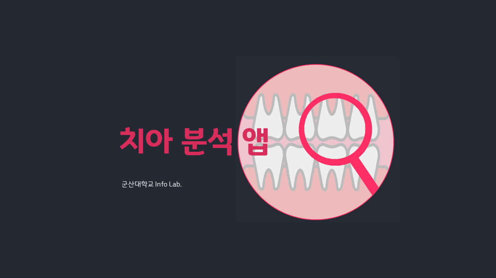
    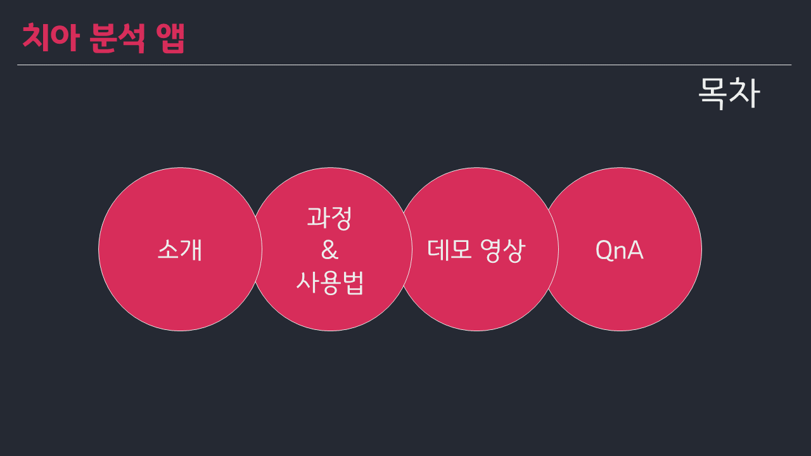
    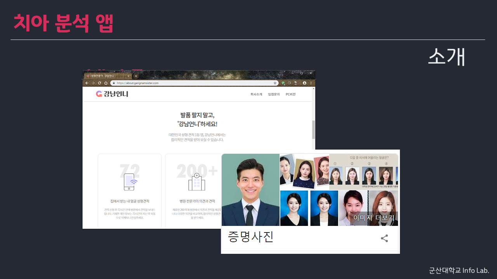
    
    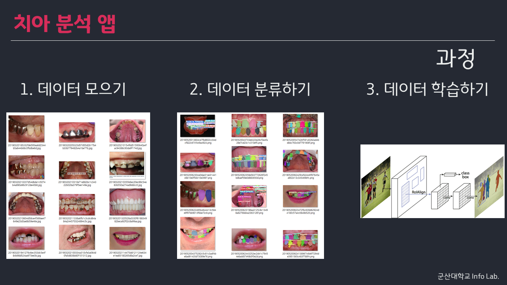
    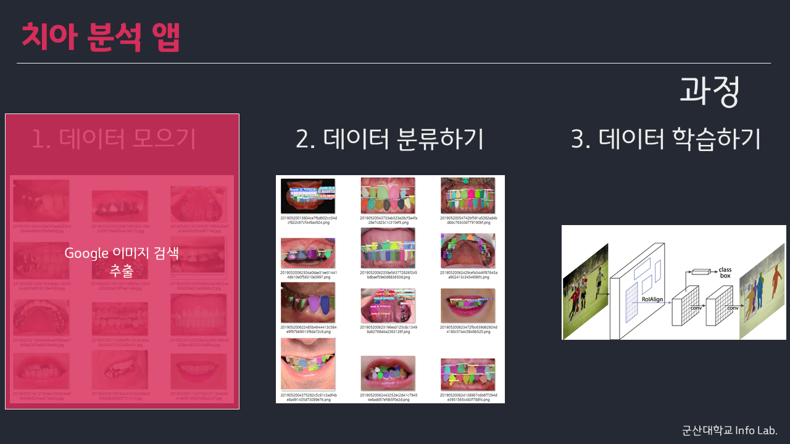
    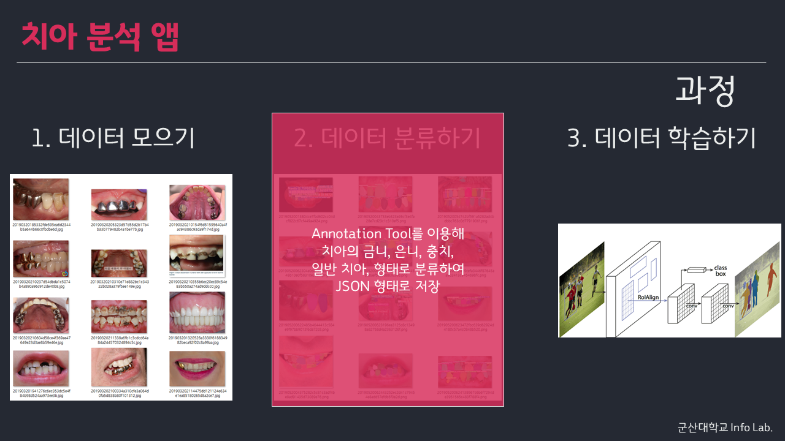
    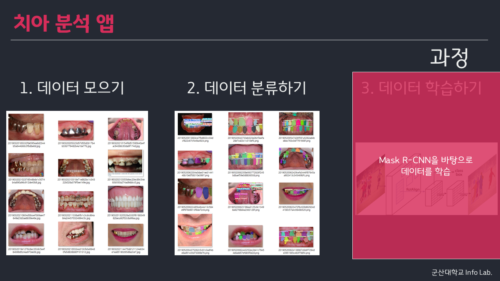
    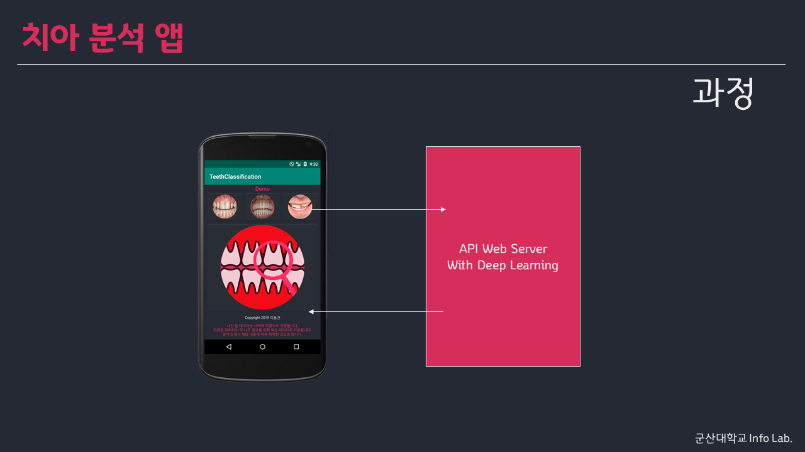
    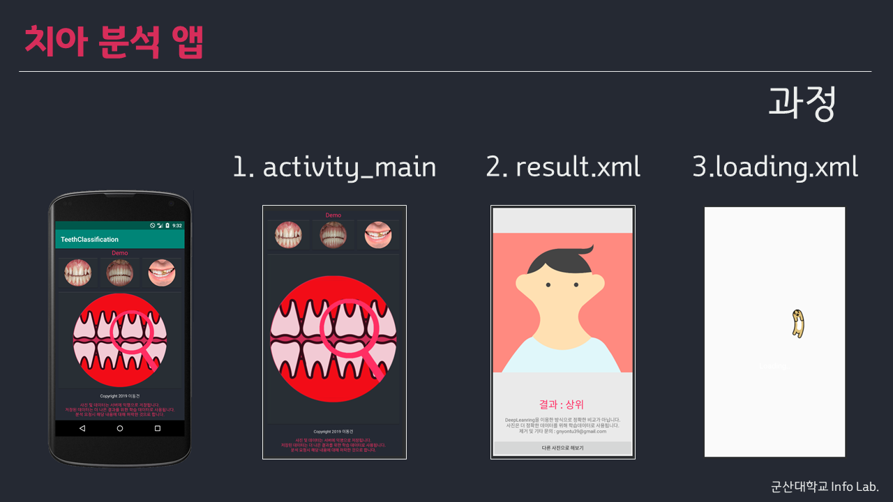
    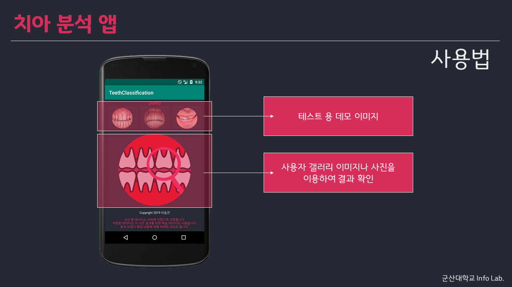
    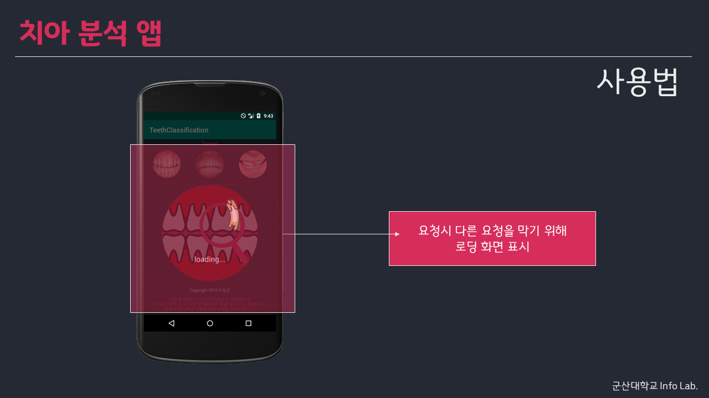
    
    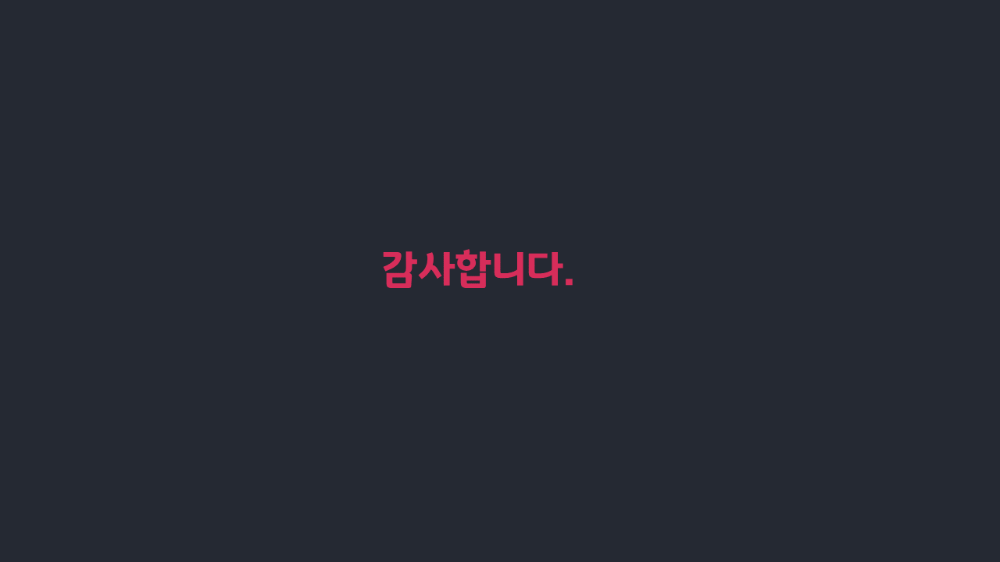
 - Demo

    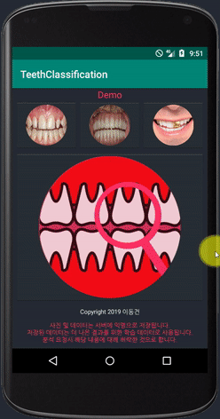